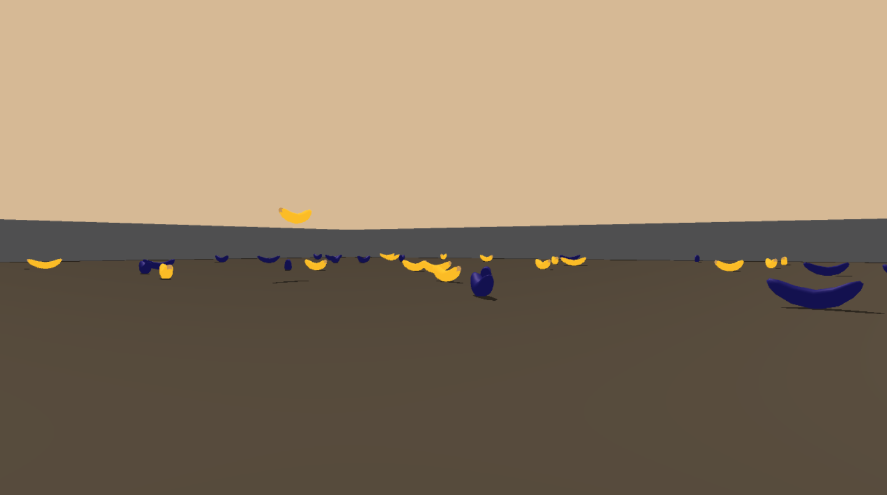

# Project Navigation

## Description

### Task
This project is about training a reinforcement learning agent that is able to navigate in a large squared game world where the aim is to collect bananas in the right color to maximize the game score. Collecting a blue banana returns a reward of -1, while collecting a yellow banana returns an reward of +1. Hence, the game score is maximized by collecting only and as many yellow bananas as possible.



### Environment
Each state in the game is described by a 37 dimensional vector of numbers. These describe the agent's velocity, along with ray-based perception of objects around the agent's forward direction. The agent can choose between four different actions to navigate in the environment:
- `0` - move forward
- `1` - move backward
- `2` - turn left
- `3` - turn right

The agent is supposed to learn to choose the right action in order to maximize the score. The problem is considered to be solved when the average score of the last 100 episodes is bigger than 13.  

## Setup

### File description
- `Navigation.ipynb`: Jupyter notebook to load the environment and train the agent
- `dqn_agent.py`    : Contains an agent class that interactions with and learns from the environment
- `dqn_model.py`    : Contains a model class that creates a q-network for the agent
- `agent.pth`       : File containing the Q-Network of the successful agent
- `report.pdf`      : Report about the applied algorithms and the results
- `requirements.txt`: Text file containing the installation requirements


### Dependencies
To execute the code on your machine, please clone the repository and perform the tasks in the following description. The code of the agent is based on Python 3 with additional libraries. All the dependencies are listed in the `requirements.txt` and can be installed with the command:
```
pip install requirements.txt
```

Additionally, you need to download the environment which matches your operating system from one of the links below. Afterwards, you need to place the file and unzip it in your repository folder.
- Linux : [link](https://s3-us-west-1.amazonaws.com/udacity-drlnd/P1/Banana/Banana_Linux.zip)
- MAC OSX : [link](https://s3-us-west-1.amazonaws.com/udacity-drlnd/P1/Banana/Banana.app.zip)
- Windows (32-bit): [link](https://s3-us-west-1.amazonaws.com/udacity-drlnd/P1/Banana/Banana_Windows_x86.zip)
- Windows (64-bit): [link](https://s3-us-west-1.amazonaws.com/udacity-drlnd/P1/Banana/Banana_Windows_x86_64.zip)


## Execution
Execute the cells in the notebook `Navigation.ipynb` sequentially to explore the environment and train the agent to solve the task. The last cell is not required, but feel free to choose your set of parameters to execute a grid search and to try find better model parameters.
